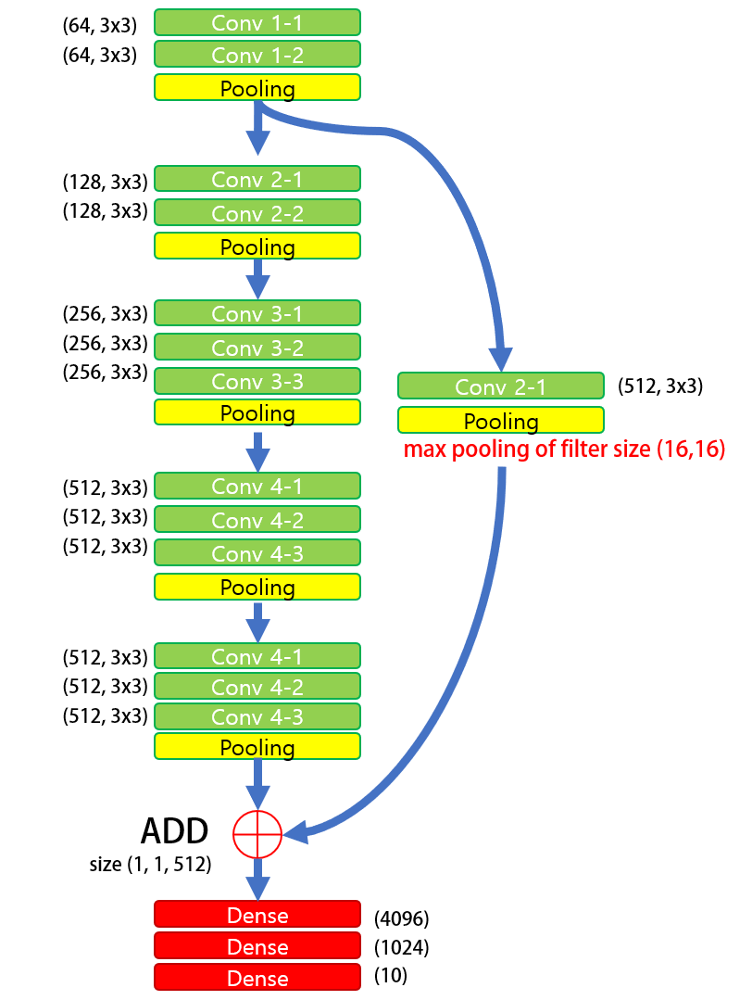
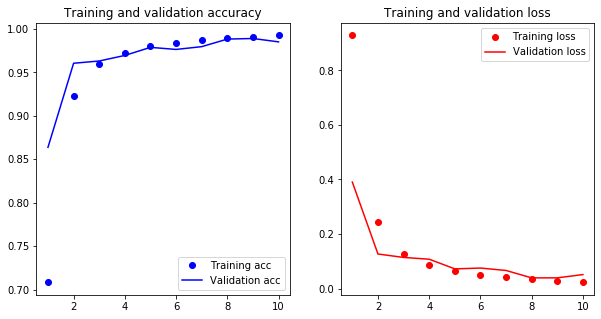

# VGG 16 Skip connection으로 구현하기 with *Keras*

### prography-6th-deep-박범진

* Python == 3.6
* matplotlib == 3.1.3
* pandas == 1.0.1
* numpy == 1.18.1
* keras == 2.3.1
* tensorflow == 2.1

 

> Data 

MNIST 데이터를 **data 폴더 안에 data zip**으로 저장해뒀습니다. 

data 폴더에 풀어주면 됩니다.

|Split|size|
|---|---|
Train |50000 
Valid| 10000
Test  |10000

 

> Training

|Env|Time|eopchs |Accuracy| loss|
|---|---|---|---| ---|
|Lenova (NVIDIA GeForce 1050 4GB)| as|sa |as| as|
|Google Colab GPU|4min| 5  | **0.987**| 0.038|
|Google Colab GPU|8min| 10  | **0.997**|0.007|

 

> 모델 ADT 

**VGG with skip connection** 

기존 VGG16 구조에서 첫 번째 max pooling 이후 값을 분리하여 

Conv, Maxp ooling 을 통하여 사이즈를 맞추고

ADD에서 두 텐서를 더해주는 형태로 구성하였습니다.  

---
> Structure

---
> Accuracy and loss

